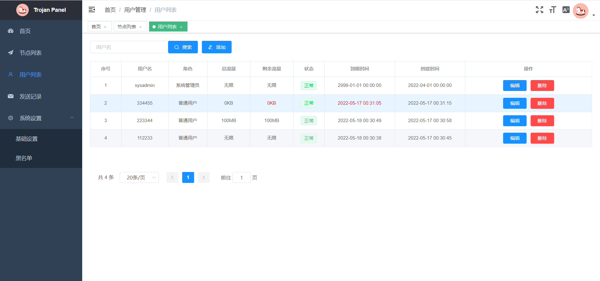

# Trojan Panel

支持多协议的可视化管理面板

# Installation

For CentOS 6+:

```shell
yum install -y wget;wget --no-check-certificate -O install_script.sh https://github.com/trojanpanel/install-script/raw/main/install_script.sh;chmod 777 install_script.sh;./install_script.sh
```

For Ubuntu 16+/Debian 8+:

```shell
apt install -y wget;wget --no-check-certificate -O install_script.sh https://github.com/trojanpanel/install-script/raw/main/install_script.sh;chmod 777 install_script.sh;./install_script.sh
```

# Enjoy!



# Features

1. 3分钟傻瓜式一键安装所有服务，占内存小
2. 自动申请/续签证书
3. 功能强大的多用户可视化管理面板，支持用户管理、节点管理、邮件管理、黑名单管理、自定义伪装网站、系统看板等
4. 节点类型支持多协议，例如: trojan-go、hysteria
5. 支持数据库版节点集群和单机版节点

# Documentation

请参考[Wiki](https://github.com/trojanpanel/install-script/wiki)

# Bugs & Issues

[Issues](https://github.com/trojanpanel/install-script/issues) or [Trojan Panel交流群](https://t.me/TrojanPanelGroup)

# Thanks

- [trojan-gfw](https://github.com/trojan-gfw/trojan)
- [trojan-go](https://github.com/p4gefau1t/trojan-go)
- [hysteria](https://github.com/HyNetwork/hysteria)
